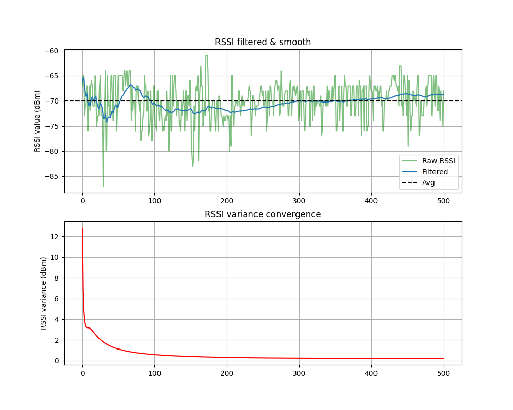

## Filtering RSSI with Kalman Filter
<b>500 continuous records of iBeacon signal.</b>

Producing white noise to compare with our data.

Plot data's density & random gaussian's density, they are same shape.

We can treat our sensor signal as a Gaussian, it's error is about <b>3.84(dBm)</b>.

## Filtered result

Data has been collected while standing.

